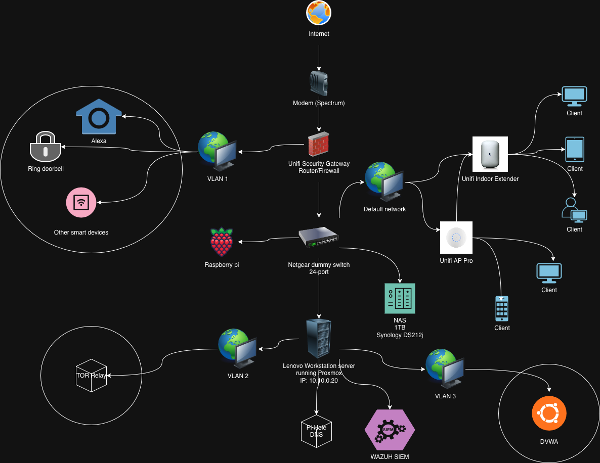

# My Homelab Setup

Welcome to my homelab documentation!  
This environment is where I experiment with IT infrastructure, cybersecurity tools, networking, and automation.  
The goal of this lab is to **learn by building, breaking, and securing real-world services**.

---

## **🏗️ Hardware Overview**
- **Ubiquiti USG** – Firewall, VPN  
- **Synology NAS** – Private cloud storage & backups  
- **Raspberry Pi 4** – Running as a UniFi Cloud Key  
- **Netgear 24-Port 1Gb Switch** – Core network connectivity  
- **Lenovo ThinkCentre Workstation** – Running **Proxmox VE** for virtualization

---

## **🌐 Network Diagram

---

## **🖥️ Virtualized Services (via Proxmox)**
- **Pi-hole** – Network-wide ad blocking & DNS filtering  
- **Home Assistant** – Smart home & automation  
- **Tor Relay** – Contributing to online privacy/anonymity
- **Wazuh(in a container)** – Security Information and Event Management (SIEM) 
Proxmox (bare metal) → VM (Ubuntu) → Docker containers (Wazuh stack).
Each layer provides isolation and makes things easier to manage:
    Want to upgrade Wazuh? Just replace the Docker containers.
    Want to snapshot the entire Wazuh environment? Just snapshot the VM.
    If something breaks, you’re not messing with your Proxmox host.

---

## **📐 Network Diagram**
*(Add a diagram here — e.g., an image link like ``)*  
> _Diagram built using [draw.io](https://draw.io) or [Excalidraw](https://excalidraw.com/)._

---

## **🛠️ Why This Setup?**
- Hands-on practice with **firewalls, VPNs, and DNS** for cybersecurity.  
- Learning **virtualization and containerization** using Proxmox.  
- Building automation workflows with **Home Assistant**.  
- Gaining experience with **network monitoring and ad-blocking** (Pi-hole).  

---

## **🚀 Future Plans**
- Deploy a **SIEM solution** (e.g., Wazuh or ELK Stack).  
- Add **Docker containers** for additional services (e.g., Nextcloud).  
- Set up a **Vulnerability Scanner** (e.g., OpenVAS).  
- Improve network segmentation and security policies.

---

## **📚 Resources & References**
- [Proxmox VE Documentation](https://pve.proxmox.com/wiki/Main_Page) Craft Computing on YouTube (https://www.youtube.com/watch?v=sZcOlW-DwrU&t=843s&pp=ygUXY3JhZnQgY29tcHV0aW5nIHByb3htb3g%3D)
- [Pi-hole Setup Guide](https://docs.pi-hole.net/)  
- [Home Assistant](https://www.home-assistant.io/)  
- [Ubiquiti USG Config](https://help.ui.com/hc/en-us/categories/204909067-UniFi-Security-Gateway-USG-)  

---

## **💡 Lessons Learned**
I use this repo as a log of experiments, challenges, and solutions I’ve found while maintaining the lab.  
**Check out the [Wiki](./wiki) (coming soon)** for detailed step-by-step guides.

---

## **🤝 Connect with Me**
If you have ideas, suggestions, or want to share your own homelab setup, feel free to connect with me on [LinkedIn](https://www.linkedin.com/in/hector-diaz-cyber/).
