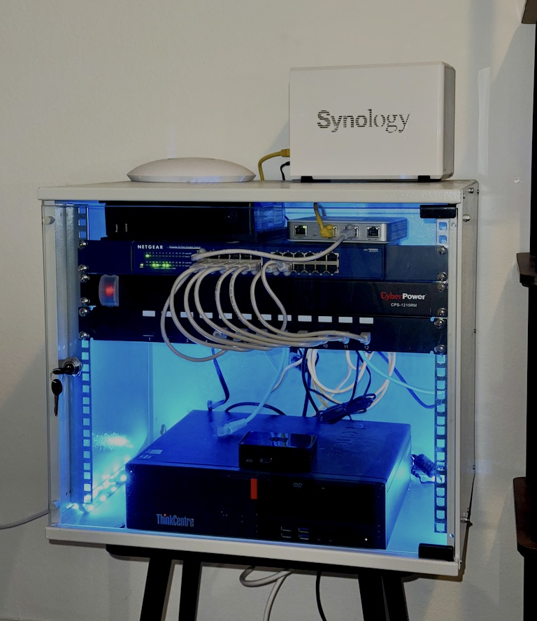
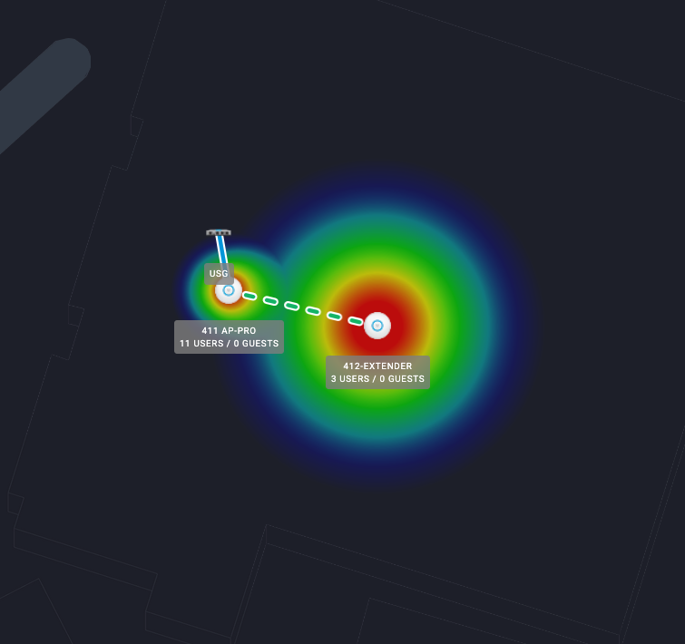

# My Homelab Setup

Welcome to my homelab documentation!  
This environment is where I experiment with IT infrastructure, cybersecurity tools, networking, and automation.  
The goal of this lab is to **learn by building, breaking, and securing real-world services**.

---

## **🏗️ Hardware Overview**
- **Ubiquiti USG** – Firewall, VPN  
- **Synology NAS** – Private cloud storage & backups  
- **Raspberry Pi 4** – Running as a UniFi Cloud Key  
- **Netgear 24-Port 1Gb Switch** – Core network connectivity  
- **Lenovo ThinkCentre Workstation** – Running **Proxmox VE** for virtualization

---

## **🌐 Network Diagram**

---

## **🖼️ Homelab Setup**

---

## **🖥️ Virtualized Services (via Proxmox)**
- **Pi-hole** – Network-wide ad blocking & DNS filtering  
- **Home Assistant** – Smart home & automation  
- **hectordiaz.net (self-hosted using a cloudflare tunnel)** - Self-hosted Python/Flask dashboard secured via **Cloudflare Tunnels** (Zero Trust / No open ports)
- **Tor Relay** – Contributing to online privacy/anonymity
- **Wazuh(in a container)** – Security Information and Event Management (SIEM) 
Proxmox (bare metal) → VM (Ubuntu) → Docker containers (Wazuh stack).
Each layer provides isolation and makes things easier to manage:
    Want to upgrade Wazuh? Just replace the Docker containers.
    Want to snapshot the entire Wazuh environment? Just snapshot the VM.
    If something breaks, you’re not messing with your Proxmox host.

---

## **🛠️ Why This Setup?**
- Hands-on practice with **firewalls, VPNs, and DNS** for cybersecurity.  
- Learning **virtualization and containerization** using Proxmox.  
- Building automation workflows with **Home Assistant**.  
- Gaining experience with **network monitoring and ad-blocking** (Pi-hole).  

---

## **🚀 Future Plans**
- Deploy a **SIEM solution** (e.g., Wazuh or ELK Stack).  
- Add **Docker containers** for additional services (e.g., Nextcloud).  
- Set up a **Vulnerability Scanner** (e.g., OpenVAS).  
- Improve network segmentation and security policies.

---

## **📚 Resources & References**
- [Proxmox VE Documentation](https://pve.proxmox.com/wiki/Main_Page) Craft Computing on YouTube (https://www.youtube.com/watch?v=sZcOlW-DwrU&t=843s&pp=ygUXY3JhZnQgY29tcHV0aW5nIHByb3htb3g%3D)
- [Pi-hole Setup Guide](https://docs.pi-hole.net/)  
- [Home Assistant](https://www.home-assistant.io/)  
- [Ubiquiti USG Config](https://help.ui.com/hc/en-us/categories/204909067-UniFi-Security-Gateway-USG-)  

---

## **💡 Lessons Learned**
I use this repo as a log of experiments, challenges, and solutions I’ve found while maintaining the lab. It's essentially a playground that I get to use to learn and experiment with new technologies.

### Google Maps API Integration with UniFi Controller

When integrating Google Maps API with UniFi Controller for map visualization in the dashboard, several key lessons were learned:

**The Challenge:** After enabling the Google Maps API key and adding it to the UniFi controller, the map view wasn't appearing in the dashboard.

**The Solution Process:**

1. **UI Navigation:** In modern UniFi Network Application (8.x+), the classic "Map" feature has been replaced by InnerSpace or Design Center. The map view is found in:
   - Navigate to Topology or Floorplans section
   - Look for dropdown/icon to switch from "Topology" to "Satellite" or "Map"
   - Note: Some features are restricted in "New UI" vs "Legacy UI"

2. **API Library Requirements:** A single API key isn't enough - these specific Google Cloud APIs must be enabled:
   - Maps JavaScript API (renders the actual map)
   - Geocoding API (translates addresses to coordinates)
   - Places API (location searching)
   - Geolocation API

3. **Billing & Restrictions:** 
   - Active billing account required (even with $200/month free tier)
   - If API key is restricted, add UniFi Controller IP/Domain to "Allowed Referrers"

**The Breakthrough:** Using browser developer tools revealed the specific error and URL that needed authorization: `https://10.10.0.10:8443/api/s/default/cmd/lte`

Adding this URL to the Google Cloud Console's allowed referrers list resolved the issue immediately.

**Key Takeaway:** Always check browser developer tools for specific API errors - they often provide the exact URLs needed for authorization.

---

## **🤝 Connect with Me**
If you have ideas, suggestions, or want to share your own homelab setup, feel free to connect with me on [LinkedIn](https://www.linkedin.com/in/hector-diaz-cyber/).
